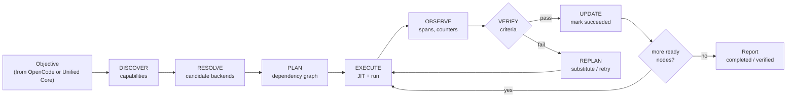
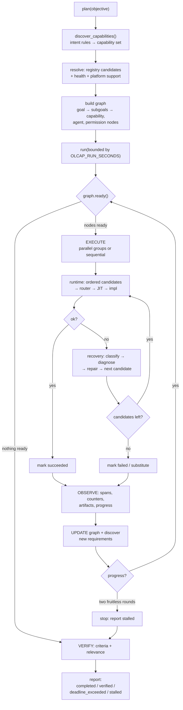
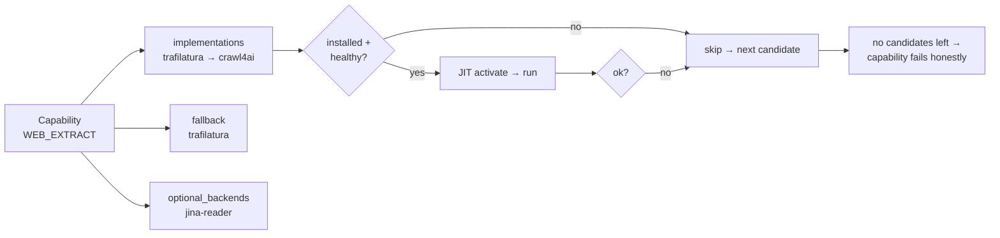

<div align="center">

# OLCAP

### Open Local Capability & Automation Platform

**One Core. Three MCP Servers. Twenty-Nine Capabilities. Real Local Execution.**

<p>
  
  
  
  
  
</p>

<p>
  
  
  
  
  
</p>

<p>
  
  
  
</p>

**Work in progress · actively validated · every number above is read from this repository**

</div>

---

## What is OLCAP?

OLCAP is a **local capability and automation platform** that sits underneath an existing
[OpenCode](https://opencode.ai) installation and exposes its abilities as three grouped
**MCP (Model Context Protocol)** servers.

It is not a chatbot, not an agent framework, and not a replacement for anything above it.
It is the layer that **actually does the work**: searching the web, extracting content,
running research, querying data, editing files, running terminal commands, driving the
desktop, orchestrating multi-step objectives — with permissions, verification, health and
provenance built in.

```text
┌──────────────────────────────────────────────────────────────────────────────┐
│  OLCAP  =  capability + execution layer                                       │
│                                                                              │
│   • 29 capabilities, 3 MCP servers, 62 registered components                 │
│   • One authoritative controller (Unified Core) and one authoritative state   │
│   • Live dependency graph that plans, executes, observes and replans          │
│   • Permission engine, verification, health, provenance, observability        │
│   • Bounded execution: nothing runs forever, nothing is silently faked        │
└──────────────────────────────────────────────────────────────────────────────┘
```

---

## Why OLCAP?

| Problem with tool collections | What OLCAP does instead |
|---|---|
| Tools are independent; the model must wire them together | A **dependency graph** orders the work: a write step runs *after* the research it depends on |
| A missing package silently breaks a tool | Missing backends are **skipped, never faked**; the next real backend runs |
| "Installed" is confused with "works" | Components are **probed and functionally checked**; health is a first-class object |
| No idea what happened during a run | **Spans, counters, events, artifacts and traces** are persisted for every run |
| Dangerous actions are one prompt away | A **config-driven permission engine** with deny-paths, auditing and approval gates |
| Long tasks hang | Every network call, every worker call and every objective is **time-bounded** |
| Results are asserted, not checked | Verification is explicit, and `completed` is reported separately from `verified` |

---

## Architecture

### The stack

```text
                        ┌───────────────────────────────┐
                        │          OpenLive              │   interface layer
                        │   voice / UI  (not in repo)    │   untouched by OLCAP
                        └───────────────┬───────────────┘
                                        │
                        ┌───────────────▼───────────────┐
                        │          OpenCode              │   agent / skills / model
                        │  SKILL.md + Google/Groq router │   untouched by OLCAP
                        └───────────────┬───────────────┘
                                        │  MCP (stdio, JSON-RPC)
        ┌───────────────────────────────▼───────────────────────────────┐
        │                     OLCAP UNIFIED CORE                         │
        │  registry · graph · orchestration · routing · permissions      │
        │  JIT · health · observability · verification · recovery        │
        │  state · provenance · component manager · platform adapters    │
        └──┬────────────────────────┬────────────────────────┬───────────┘
           │                        │                        │
   ┌───────▼────────┐      ┌────────▼───────┐      ┌─────────▼──────────┐
   │  web_browser   │      │ research_      │      │ data_automation_os │
   │   7 tools      │      │ knowledge      │      │     16 tools       │
   │                │      │   6 tools      │      │                    │
   └───────┬────────┘      └────────┬───────┘      └─────────┬──────────┘
           │                        │                        │
           └────────────┬───────────┴────────────┬───────────┘
                        │                        │
              ┌─────────▼──────────┐   ┌─────────▼──────────┐
              │  real local        │   │  optional backends │
              │  implementations   │   │  (JIT, on demand)  │
              │  olcap-* + libs    │   │  duckdb, trafilatura,
              └────────────────────┘   │  playwright, qdrant…│
                                       └────────────────────┘
```

> **OLCAP does not replace OpenCode or OpenLive.** OpenLive stays the interface. OpenCode
> keeps its skills and its model routing. OLCAP is the capability/execution layer beneath
> them, and it speaks to OpenCode through standard MCP.

### One objective, many capabilities



---

## Unified Core

Every subsystem below exists in `olcap/core/` and is wired into every run.

| Subsystem | Module | Why it exists |
|---|---|---|
| **Capability Registry** | `registry.py` | Single source of truth: 29 capabilities, 62 components, servers, permissions, platforms. Loads `config/capabilities.yaml` + `config/components.yaml` and registers 3 in-code components. |
| **Dependency Graph** | `graph.py` | The live plan. 22 node types (goal, subgoal, capability, agent, permission, platform, verification, worker…), 12 edge types (`depends_on`, `requires_capability`, `requires_permission`, `assigned_agent`, `produces`, `conflicts_with`…), 9 node statuses. Provides `ready()`, `blocked_by()`, `parallel_groups()`, `critical_path()`, `find_cycles()`, `substitute()`, `progress()`. |
| **Orchestration** | `orchestrator.py` | `UnifiedCore.plan()` / `.run()` — discovers capabilities, plans the graph, executes in parallel groups, observes, handles failure, discovers new requirements, replans and finalises. |
| **Routing** | `router.py` | Picks a backend per call. Deterministic by default; a Random-Forest model is supported but **stays disabled until it beats the deterministic baseline on held-out data**. |
| **Permissions** | `permissions.py` + `config/permissions.yaml` | Config-driven policy (see [Security](#security--permissions)). Every decision is recorded in an audit trail. |
| **JIT Activation** | `jit.py` | Heavy backends start on demand in isolated worker processes (`python -m olcap.core.worker <component>`), are pooled, reused, health-checked, swept when idle, and **killed and retired if they stop answering**. |
| **Health** | `health.py` | `probe()`, `functional_check()`, `check_all()`, `summary()` over 10 health states (`healthy`, `degraded`, `unavailable`, `starting`, `released`…). |
| **Observability** | `observability.py` | `span()` context manager, `log()`, `counters()`, `recent_spans()`, plus secret `redact()` used by state and telemetry. |
| **Verification** | `verification.py` | `verify_artifact()`, `verify_capability_output()`, `verify_node()` against explicit criteria (file exists, min length, JSON schema, custom checks). |
| **Recovery** | `recovery.py` | `classify()`, `diagnose()`, `repair_component()`, `recover()`, `failure_report()` — turns failures into concrete actions. |
| **Runtime** | `runtime.py` | The one execution path: capability → ordered candidate components → router → JIT → execute → next candidate on failure. Publishes run deadlines (`set_deadline`/`jit_timeout`). |
| **State** | `state.py` | SQLite-backed authoritative state: KV store, event journal, graph nodes/edges, artifacts, component health, routing samples, `snapshot()`, `reset_all()`. Secret scrubbing on write. |
| **Agents** | `agents.py` | Role-based agents (planner, researcher, browser, coder, tester, debugger, document, data, security, verifier, automation) with a bounded pool. |
| **Model access** | `llm.py` | Goes through **OpenCode's** model path first, then Google/Groq; falls back to a deterministic extractive summariser that is always flagged `degraded`. |
| **Component Manager** | `manager/component_manager.py` | `install()`, `repair()`, `install_all()`, `report()` for optional components, plus provenance verification. |
| **Provenance** | `manager/provenance.py` | Verifies every external component against its upstream repository (licence, activity) and caches the result in `$OLCAP_HOME/data/provenance.json`. |
| **Platform adapters** | `platform/` | `OSAdapter` ABC with `WindowsAdapter` and `LinuxAdapter`; shared logic lives in `base.SharedLogic`, selection in `factory.get_adapter()`. |
| **Configuration** | `config.py` | Layered config: repository YAML + environment overrides + `$OLCAP_HOME`. |

---

## MCP Server Stack

> Every server also exposes **7 shared `core_*` tools** (`core_capabilities`, `core_health`,
> `core_objective`, `core_graph`, `core_verify`, `core_component`, `core_observability`).

<div align="center">

| # | Server | Tools | Purpose |
|---|--------|:-----:|---------|
| 1 | `olcap.servers.web_browser` | **7** | Web + Browser |
| 2 | `olcap.servers.research_knowledge` | **6** | Research + Knowledge |
| 3 | `olcap.servers.data_automation_os` | **16** | Data + Automation + Computer/OS |

</div>

### 1 · `web_browser` — Web + Browser

Multi-source search, browsing, crawling, extraction and browser automation with automatic
backend fallback.

| Tool | Capability | Backends (ordered) |
|---|---|---|
| `web_search` | `WEB_SEARCH` | `olcap-search-core` → `searxng` |
| `web_browse` | `WEB_BROWSE` | `olcap-fetch` → `playwright` |
| `web_crawl` | `WEB_CRAWL` | `olcap-crawler` → `crawl4ai` |
| `web_extract` | `WEB_EXTRACT` | `trafilatura` → `crawl4ai` |
| `web_interact` | `WEB_INTERACT` | `playwright` |
| `web_discover_sources` | `SOURCE_DISCOVERY` | `olcap-search-core` → `searxng` |
| `web_compare_sources` | `SOURCE_COMPARISON` | `olcap-search-core` |

*Built-in search needs **no API key and costs nothing** — it federates DuckDuckGo HTML,
Wikipedia/Wikidata, HackerNews (Algolia) and any SearXNG instance you point it at.*

### 2 · `research_knowledge` — Research + Knowledge

Deep research, RAG, knowledge search, documents, memory and source verification.

| Tool | Capability | Backends (ordered) |
|---|---|---|
| `research_run` | `RESEARCH` | `olcap-research-engine` |
| `knowledge_search` | `KNOWLEDGE_SEARCH` | `olcap-rag` |
| `rag_query` | `RAG` | `olcap-rag` → `llamaindex` → `haystack` |
| `memory_op` | `MEMORY` | `olcap-memory` → `mem0` → `cognee` → `graphiti` |
| `document_process` | `DOCUMENT_INTELLIGENCE` | `pypdf` → `python-docx` → `olcap-text-extract` → `trafilatura` → `docling` → `unstructured` → `marker` |
| `source_verify` | `SOURCE_VERIFICATION` | `olcap-research-engine` |

### 3 · `data_automation_os` — Data + Automation + Computer/OS

Data analysis, databases, vectors, workflows, filesystem, terminal, GUI and OS control.

| Tool | Capability | Backends (ordered) |
|---|---|---|
| `data_analyze` | `DATA_ANALYSIS` | `duckdb` |
| `database_query` | `DATABASE_QUERY` | `duckdb` |
| `vector_store_op` | `VECTOR_STORAGE` | `sqlite-vec` → `qdrant` → `chroma` |
| `workflow_run` | `WORKFLOW_EXECUTION` | `olcap-workflows` |
| `task_schedule` | `DURABLE_TASKS` | `olcap-workflows` |
| `filesystem_op` | `FILESYSTEM` | `olcap-os-adapter` |
| `terminal_run` | `TERMINAL` | `olcap-os-adapter` |
| `process_control` | `PROCESS_CONTROL` | `olcap-os-adapter` |
| `computer_use` | `COMPUTER_USE` | `olcap-os-adapter` |
| `windows_control` | `WINDOWS_CONTROL` | `olcap-os-adapter` |
| `gui_action` | `GUI` | `olcap-os-adapter` → `playwright` |
| `screenshot_capture` | `SCREENSHOT` | `pillow` → `olcap-os-adapter` → `playwright` |
| `window_manage` | `WINDOW_MANAGEMENT` | `olcap-os-adapter` |
| `observability_report` | `OBSERVABILITY` | `olcap-observability` |
| `verify_result` | `VERIFICATION` | `olcap-verification` → `ragas` |
| `routing_model_op` | `ROUTING` | `olcap-deterministic-router` |

> [!WARNING]
> This server can **really** write files, run commands, kill processes and drive your
> desktop. Those actions exist to be useful — and they are exactly why the permission
> engine and the bounded-execution rules are not optional.

---

## Capability Map

<details open>
<summary><b>Web &amp; Sources</b> — 7 capabilities</summary>

| Capability | Tool | Server |
|---|---|---|
| `WEB_SEARCH` | `web_search` | web_browser |
| `WEB_BROWSE` | `web_browse` | web_browser |
| `WEB_CRAWL` | `web_crawl` | web_browser |
| `WEB_EXTRACT` | `web_extract` | web_browser |
| `WEB_INTERACT` | `web_interact` | web_browser |
| `SOURCE_DISCOVERY` | `web_discover_sources` | web_browser |
| `SOURCE_COMPARISON` | `web_compare_sources` | web_browser |

</details>

<details open>
<summary><b>Research, Knowledge, RAG &amp; Memory</b> — 5 capabilities</summary>

| Capability | Tool | Server |
|---|---|---|
| `RESEARCH` | `research_run` | research_knowledge |
| `KNOWLEDGE_SEARCH` | `knowledge_search` | research_knowledge |
| `RAG` | `rag_query` | research_knowledge |
| `MEMORY` | `memory_op` | research_knowledge |
| `SOURCE_VERIFICATION` | `source_verify` | research_knowledge |

</details>

<details open>
<summary><b>Documents</b> — 1 capability</summary>

| Capability | Tool | Server |
|---|---|---|
| `DOCUMENT_INTELLIGENCE` | `document_process` | research_knowledge |

</details>

<details open>
<summary><b>Data, Database &amp; Vectors</b> — 3 capabilities</summary>

| Capability | Tool | Server |
|---|---|---|
| `DATA_ANALYSIS` | `data_analyze` | data_automation_os |
| `DATABASE_QUERY` | `database_query` | data_automation_os |
| `VECTOR_STORAGE` | `vector_store_op` | data_automation_os |

</details>

<details open>
<summary><b>Automation &amp; Workflow</b> — 2 capabilities</summary>

| Capability | Tool | Server |
|---|---|---|
| `WORKFLOW_EXECUTION` | `workflow_run` | data_automation_os |
| `DURABLE_TASKS` | `task_schedule` | data_automation_os |

</details>

<details open>
<summary><b>Filesystem, Terminal &amp; Process</b> — 3 capabilities</summary>

| Capability | Tool | Server |
|---|---|---|
| `FILESYSTEM` | `filesystem_op` | data_automation_os |
| `TERMINAL` | `terminal_run` | data_automation_os |
| `PROCESS_CONTROL` | `process_control` | data_automation_os |

</details>

<details open>
<summary><b>GUI, Screen &amp; Windows/OS</b> — 4 capabilities</summary>

| Capability | Tool | Server |
|---|---|---|
| `COMPUTER_USE` | `computer_use` | data_automation_os |
| `WINDOWS_CONTROL` | `windows_control` | data_automation_os |
| `GUI` | `gui_action` | data_automation_os |
| `SCREENSHOT` | `screenshot_capture` | data_automation_os |
| `WINDOW_MANAGEMENT` | `window_manage` | data_automation_os |

</details>

<details open>
<summary><b>Verification, Observability &amp; Routing</b> — 3 capabilities</summary>

| Capability | Tool | Server |
|---|---|---|
| `VERIFICATION` | `verify_result` | data_automation_os |
| `OBSERVABILITY` | `observability_report` | data_automation_os |
| `ROUTING` | `routing_model_op` | data_automation_os |

</details>

Full machine-readable inventory: [`tools.manifest.yaml`](tools.manifest.yaml) ·
per-tool reference: [`TOOLS.md`](TOOLS.md).

---

## Execution Lifecycle



**What is actually enforced**

| Behaviour | Mechanism |
|---|---|
| Ordering is real | A node only becomes ready when its dependencies have **succeeded or been skipped** — queued-but-unrun does not count |
| Bounded network | Every fetch is hard-bounded, including DNS and TLS; a blackhole host fails inside its timeout |
| Bounded calls | Each capability call is capped by the time left in the run (`set_deadline` / `jit_timeout`) |
| Bounded objectives | `OLCAP_RUN_SECONDS` (default 300 s) wall clock; abandoned nodes are marked skipped, not left pending |
| Bounded fan-out | Research and source verification have their own internal budgets and report `budget_exhausted` when partial |
| No infinite loops | Two consecutive iterations with no new progress end the run (`stalled`) |
| Silent workers die | A JIT worker that stops answering is killed, retired from the pool and replaced |
| Honest results | `completed` (work finished, verification passed) is reported **separately** from `verified` (checked against objective-specific criteria) |

---

## Design Principles

**Local-first, self-hosted-first.** Of the 59 declared components, **none require a paid
service** and **58 are self-hostable**; only 4 need an external API key, and all of those
are optional. Nine declared components are built in — twelve in-repo once the router,
observability and verification components registered in code are counted.

**Nothing is faked.** A backend that is not installed is *skipped* — never stubbed with
plausible-looking output. Capabilities advertise a backend only when code in this
repository can actually dispatch to it; known-but-unwired components live in a separate
`optional_backends` inventory so the registry never claims more than it can run.

**Graceful degradation, always labelled.** When the model path is unavailable, planning
falls back to a deterministic extractive summary and the run reports `model_degraded` —
and that fallback is **not** allowed to define success criteria, so the run cannot mark
itself `verified` on invented criteria.

**Verification over assertion.** Results are checked against criteria (file exists,
minimum length, JSON schema, custom checks). Term-overlap relevance is *reported*, never
used as a pass/fail gate.

**Provenance and observability.** Every external component is verified against its
upstream repository (licence and activity) and cached; every run produces spans, counters,
events, traces and artifacts under `$OLCAP_HOME`.

**Bounded and observable by default.** Every level — network, call, objective — has a
deadline, and every level records what it did.

---

## Real-World Examples

<details open>
<summary><b>1 · Web search</b></summary>

```python
from olcap.core.runtime import execute
execute("WEB_SEARCH", {"query": "DuckDB vs SQLite", "max_results": 5})
```

**Objective ↓** find authoritative pages → **capability** `WEB_SEARCH` →
**backend** `olcap-search-core` (no API key) → **result** ranked results with engine + trust
</details>

<details>
<summary><b>2 · Research</b></summary>

```python
execute("RESEARCH", {"question": "What is DuckDB good at?", "depth": 2, "max_sources": 8})
```

**Objective ↓** decompose into sub-questions → **capability** `RESEARCH` →
**execution** search each sub-question → fetch evidence → synthesise →
**verification** `SOURCE_VERIFICATION` over the sources → **result** report + findings +
confidence, `budget_exhausted` set if it ran out of time
</details>

<details>
<summary><b>3 · Knowledge / RAG</b></summary>

```python
execute("RAG", {"action": "ingest", "collection": "notes", "paths": ["./docs"]})
execute("RAG", {"action": "query", "collection": "notes", "question": "What did we conclude?"})
```

**Objective ↓** ingest documents → **capability** `RAG` → **backends** `olcap-rag` (sqlite-vec
+ built-in embeddings) → **result** answers with citations
</details>

<details>
<summary><b>4 · File creation</b></summary>

```python
execute("FILESYSTEM", {"action": "write", "path": "./notes.md", "content": "# Notes\n"})
```

**Objective ↓** write → **capability** `FILESYSTEM` → **permissions** write + path policy →
**backend** `olcap-os-adapter` → **verification** file exists and is non-empty
</details>

<details>
<summary><b>5 · Data analysis</b></summary>

```python
execute("DATA_ANALYSIS", {"action": "profile", "path": "./sales.csv"})
execute("DATABASE_QUERY", {"sql": "SELECT region, SUM(total) FROM sales GROUP BY 1"})
```

**Objective ↓** profile/query → **backends** `duckdb` → **result** schema, statistics, rows
</details>

<details>
<summary><b>6 · Terminal execution</b></summary>

```python
execute("TERMINAL", {"command": ["git", "status", "--short"]})   # argv by default
```

**Objective ↓** run → **permissions** `execute` (gated) → **adapter** runs argv, **not** a
shell, unless you explicitly pass `shell` → **result** stdout/stderr/exit code
</details>

<details>
<summary><b>7 · GUI / Windows automation</b></summary>

```python
execute("SCREENSHOT", {"target": "screen"})
execute("WINDOWS_CONTROL", {"action": "services"})
execute("GUI", {"action": "click", "x": 400, "y": 300})
```

**Objective ↓** interact with the desktop → **permissions** `execute` → **adapter**
`WindowsAdapter` / `LinuxAdapter` → **result** action report or image artifact
</details>

<details>
<summary><b>8 · Multi-step objective orchestration</b></summary>

```python
from olcap.core.orchestrator import UnifiedCore
core = UnifiedCore()
core.plan("Search the web for DuckDB, then write a short note about it to ./note.md, "
          "then verify the note exists.")
result = core.run(max_seconds=120)
```

**Objective ↓** `WEB_SEARCH` → `WEB_EXTRACT` → `FILESYSTEM` (write) → `SOURCE_VERIFICATION`
→ `VERIFICATION` — planned as a graph, executed in order, each step bounded.
</details>

---

## Automation & Orchestration

The difference between "a collection of MCP tools" and OLCAP is the **Unified Core**:
give it an objective, and it decides which capabilities are needed, orders them, runs them,
and checks the result.

```text
Objective: "Research X → analyse the information → write a file → verify the result"
```

| Step | Capability | What happens |
|---|---|---|
| 1 | `WEB_SEARCH` / `RESEARCH` | Decompose the question, gather and extract sources |
| 2 | `SOURCE_VERIFICATION` | Check the evidence actually supports the claims |
| 3 | `DATA_ANALYSIS` | Profile / aggregate anything structured that came back |
| 4 | `FILESYSTEM` | Write the report **after** the analysis nodes have succeeded |
| 5 | `VERIFICATION` | Check the artifact against the objective's success criteria |

Each step is a graph node. A write step literally cannot run before the research it
consumes has finished — that ordering bug (the whole graph used to execute as one batch)
was found and fixed during validation, and layer 8 re-attacks it on every run.

---

## OpenCode Integration

OLCAP registers itself into an existing OpenCode installation as **three MCP servers**.
OpenCode starts and supervises all three; you do not run them by hand.

### Quick Start (zero → first successful MCP call)

```powershell
# 1 · the MCP SDK is the only hard requirement
pip install mcp

# 2 · see what OpenCode install OLCAP finds
python -m olcap.opencode --probe

# 3 · merge all three servers into opencode.json (backups the file first)
python -m olcap.opencode --register

# 4 · prove each one really launches
python -m olcap.opencode --verify

# 5 · restart OpenCode, then talk to it:
#     "search the web for DuckDB and write a short note to notes.md"
```

**First MCP call by hand** (what OpenCode does for you):

```powershell
echo {"jsonrpc":"2.0","id":1,"method":"tools/list","params":{}} | python -m olcap.servers.web_browser
```

### What registration writes

Three entries, one per server. Nothing else in your config is touched — your `model`,
`provider` (Google/Groq), `permission`, `instructions`, skills and any MCP server you
already had stay exactly as they were.

```json
"mcp": {
  "olcap-web-browser": {
    "type": "local",
    "command": ["python", "-m", "olcap.servers.web_browser"],
    "enabled": true,
    "environment": {
      "PYTHONPATH": "<folder that CONTAINS olcap/>",
      "PYTHONIOENCODING": "utf-8",
      "OLCAP_HOME": "%USERPROFILE%\\.olcap"
    }
  },
  "olcap-research-knowledge": { "...": "..." },
  "olcap-data-automation-os": { "...": "..." }
}
```

The entry shape follows the **detected** OpenCode variant: `mcp` with
`type/command/environment` for `sst/opencode`, or `mcpServers` with
`command/args/env` for other layouts.

### Windows

```powershell
pip install mcp
python -m olcap.opencode --probe
python -m olcap.opencode --register
python -m olcap.opencode --verify
```

If auto-detection misses your config:

```powershell
python -m olcap.opencode --register --config "$env:APPDATA\opencode\opencode.json"
```

### Linux

```bash
pip install mcp
python3 -m olcap.opencode --probe
python3 -m olcap.opencode --register
python3 -m olcap.opencode --verify
# config is normally ~/.config/opencode/opencode.json
```

### Undo

```bash
python -m olcap.opencode --remove           # take the three entries out
python -m olcap.opencode --rollback         # restore the previous config file
```

### Troubleshooting registration

| Symptom | Cause | Fix |
|---|---|---|
| `--probe` reports `unknown OpenCode variant` | Config file not found, so the variant cannot be detected | Pass `--config <path>` explicitly |
| Registered, but OpenCode does not list the tools | `python` in the entry is not the interpreter with `mcp` | Register from inside the venv you actually use |
| Server exits immediately | Missing dependency or wrong `PYTHONPATH` | Run `python -m olcap.servers.web_browser` directly and read the traceback |
| Wrong platform entry generated | Config was generated while cross-targeting | Re-run `--register` on the target machine |

---

## OpenLive Integration

OpenLive is the **upper interface** (voice / UI) in the stack this project is built for.
OLCAP never replaces it and never talks to it directly — OpenLive → OpenCode → OLCAP, with
MCP as the boundary.

> [!NOTE]
> **There is no OpenLive code, adapter, or desktop/ARIA GUI in this repository.** OLCAP's
> only integration point is OpenCode (see above). If you run OpenCode without OpenLive,
> everything here still works exactly the same.

---

## Installation

There is **no packaging manifest** in this repository (`pyproject.toml`/`setup.py` are
deliberately absent), so OLCAP runs from its source tree.

```bash
# required
pip install mcp

# optional — each unlocks real backends; anything missing degrades, never fakes
pip install duckdb                # DATA_ANALYSIS, DATABASE_QUERY
pip install trafilatura           # WEB_EXTRACT, DOCUMENT_INTELLIGENCE
pip install pypdf python-docx     # DOCUMENT_INTELLIGENCE
pip install psutil                # PROCESS_CONTROL
pip install sqlite-vec            # VECTOR_STORAGE
pip install playwright && playwright install chromium   # browser automation, GUI, screenshots
```

Then place the folder that contains `olcap/` anywhere you like and keep its path — that is
the `PYTHONPATH` used in your OpenCode config.

Verify what is usable right now:

```bash
python -c "from olcap.core.health import summary; import json; print(json.dumps(summary(), indent=2)[:1200])"
```

---

## Configuration

### Environment variables

| Variable | Purpose |
|---|---|
| `OLCAP_HOME` | Where state, artifacts, logs, traces, reports and indexes live (default `~/.olcap`) |
| `PYTHONPATH` | Must contain the folder that **contains** the `olcap` package |
| `PYTHONIOENCODING` | Set to `utf-8` in generated MCP entries |
| `MCP_TRANSPORT` | MCP transport (default `stdio`) |
| `OLCAP_AUTO_APPROVE` | Non-interactive runs: auto-approve non-sensitive actions |
| `OLCAP_RUN_SECONDS` | Wall-clock budget for one objective (default `300`) |
| `MAX_CONCURRENCY` | Cap on parallel execution |
| `LLM_BACKEND` | Force the model backend (`opencode`, `google`, `groq`) |
| `LLM_TIMEOUT_S` | Model call timeout |
| `GOOGLE_API_KEY` / `GEMINI_API_KEY` / `GOOGLE_MODEL` | Google model access (routed through OpenCode by default) |
| `GROQ_API_KEY` / `GROQ_MODEL` | Groq model access |
| `OPENCODE_MODEL` | Model selection inside OpenCode |
| `SEARXNG_URL` | Point `searxng` at your own instance |
| `OPENALEX_MAILTO` | Polite-pool identifier for academic source lookup |
| `NEO4J_URI` / `NEO4J_USER` / `NEO4J_PASSWORD` | Optional graph-memory backend |
| `GITHUB_TOKEN` / `GH_TOKEN` | Raises the rate limit for provenance verification |
| `DISPLAY` / `WAYLAND_DISPLAY` / `XDG_CURRENT_DESKTOP` | Detected session type for GUI capabilities |

### Configuration files

| File | Controls |
|---|---|
| `olcap/config/capabilities.yaml` | The 29 capabilities: tools, servers, inputs, permissions, ordered implementations, fallbacks, optional backends |
| `olcap/config/components.yaml` | The 59 components: what they provide, licences, install method, platform support, resource cost, API/paid requirements |
| `olcap/config/permissions.yaml` | Permission policy: defaults, deny-paths, allow-paths, auto-approve, always-require |

### Runtime state — `$OLCAP_HOME`

```text
~/.olcap/
├── artifacts/    produced files and results
├── components/   component state
├── data/         state.db, provenance.json, DuckDB databases
├── indexes/      vector / search indexes
├── logs/         log files
├── reports/      run reports
└── traces/       spans and events
```

---

## CLI Reference

Only two entry points ship.

### `python -m olcap.opencode` — OpenCode integration

| Command | What it does |
|---|---|
| `--probe` | Inspect the OpenCode install: config path, variant, existing MCP servers, model routing, skills |
| `--register` | Merge the three servers into the config (backs it up first) |
| `--verify` | Re-read the config and check every entry really launches |
| `--remove` | Remove the three OLCAP entries |
| `--rollback [path]` | Restore a backup (latest if no path given) |

Flags: `--config PATH`, `--dry-run`, `--only name1,name2`.

### `python -m olcap.servers.<server>` — run a server

```bash
python -m olcap.servers.web_browser
python -m olcap.servers.research_knowledge
python -m olcap.servers.data_automation_os
```

Each speaks MCP over stdio. Internally, JIT workers are launched as
`python -m olcap.core.worker <component>`.

---

## Health & Observability

Every server exposes the same shared tools:

| Tool | Returns |
|---|---|
| `core_health` | Server, component and **JIT pool** health (`scope="server"` or `"all"`) |
| `core_observability` | Spans, counters, events, health and JIT pool state |
| `core_capabilities` | Every capability with implementations, fallbacks, install state and health |
| `core_graph` | Live graph: `snapshot`, `ready`, `cycles`, `critical_path`, `progress` |
| `core_verify` | Verify a result or artifact against explicit criteria |
| `core_component` | Component manager: `list`, `verify`, `install`, `repair`, `start`, `stop`, `restart`, `remove`, `rollback`, `validate`, `report` |
| `core_objective` | Set an objective, plan it, execute it, report status |

```bash
# health of the whole stack, from a shell
python -c "from olcap.core.health import summary; import json; print(json.dumps(summary(), indent=2))"

# component-by-component
python -c "from olcap.core.health import check_all; import json; print(json.dumps(check_all(), indent=2)[:800])"

# recent spans and counters
python -c "from olcap.core.observability import recent_spans, counters; print(len(recent_spans(20)), counters())"
```

Component health uses ten states: `unavailable`, `starting`, `healthy`, `degraded`,
`failed`, `stopped`, `ready`, `active`, `idle`, `released`.

---

## Security & Permissions

> [!CAUTION]
> OLCAP performs **real** actions on your machine: writing and deleting files, running
> commands, killing processes, and driving the mouse and keyboard. Treat it as you would
> treat a script with your own privileges.

**The policy lives in `olcap/config/permissions.yaml`.**

| Category | Default decision |
|---|---|
| `read` | allow |
| `write` | allow |
| `network` | allow |
| `execute` | **require_approval** |
| `external_communication` | **require_approval** |
| `destructive` | **require_approval** |
| `credentials` | **deny** |

**Protections that are enforced in code**

- **Deny paths beat everything** — `/etc`, `/boot`, `/proc`, `/sys`, `/root`, `/usr/bin`,
  `/bin`, `/sbin`, `C:\Windows`, `C:\Program Files*`, credential stores, `~/.ssh`,
  `~/.aws`, `~/.gnupg`. Symlinks that resolve into them are refused too.
- **Allow paths** — work inside `$OLCAP_HOME` is auto-approved.
- **Auto-approve patterns** — `read:*`, `network:*`, `write:olcap`.
- **Always require** — `destructive` and `credentials`, even if another rule would allow them.
- **Auditing** — every decision is appended to an audit trail.
- **Terminal runs as argv, not a shell**, unless you explicitly pass `shell`; injection
  payloads become ordinary arguments.
- **Fetching is http(s)-only** — `file://`, `ftp://` and cloud metadata addresses are
  refused at the fetch layer and again before any browser navigation.
- **Secrets are redacted** in state, events, artifacts, logs, traces and in the OpenCode
  probe report (which never echoes API keys).
- **Verification is separate from completion**, so a run cannot claim success it did not check.
- **Rollback and repair exist** — `core_component` can `repair` or `rollback` a component,
  and `--rollback` restores your OpenCode config.

Do not read this section as a sandbox. It is a policy layer on top of real OS access.

---

## Components & Backends

Four distinct concepts, and the distinction matters:

| Concept | Meaning | Example |
|---|---|---|
| **Capability** | What the system can *do* | `WEB_EXTRACT` |
| **Implementation** | A backend with real code in this repository, in priority order | `trafilatura` |
| **Backend** | The actual engine that runs | trafilatura library in an isolated worker |
| **Optional dependency** | A known engine that is **not** wired up | `jina-reader` |
| **Fallback** | What runs when the preferred backend fails | `trafilatura` after `crawl4ai` |

**When an optional dependency is missing:** it is skipped. It is never stubbed, never
simulated, and never reported as working. Capabilities may only list a backend in
`implementations` when code here can dispatch to it; everything else is kept in
`optional_backends` as inventory. That separation is enforced by the discovery layer, not
by convention.



<details>
<summary><b>Component facts, read from <code>components.yaml</code></b></summary>

| Property | Value |
|---|---|
| Declared components | 59 (62 registered: + deterministic router, observability, verification registered in code) |
| Install method | python 35 · docker 9 · builtin 9 · service 2 · node 2 · source 1 · binary 1 |
| Integration style | library 37 · service 13 · builtin 9 |
| Require a paid service | **0** |
| Self-hostable | 58 of 59 |
| Need an external API key | 4 (all optional) |
| Licences recorded | Apache-2.0 32 · MIT 17 · BSD-3-Clause 3 · AGPL-3.0 2 · PostgreSQL 1 · PSF-2.0 1 · HPND 1 · Elastic-2.0 1 · dual MIT/Apache-2.0 1 |

Every external component is verified against its upstream repository and cached in
`$OLCAP_HOME/data/provenance.json`.

</details>

---

## Project Structure

```text
olcap/
├── config/
│   ├── capabilities.yaml        29 capabilities: tools, inputs, permissions, backends
│   ├── components.yaml          59 components: provenance, licence, install, platforms
│   └── permissions.yaml         permission policy: defaults, deny/allow paths, approvals
├── core/
│   ├── orchestrator.py          Unified Core: plan(), run(), failure handling, finalise
│   ├── graph.py                 live dependency graph (nodes, edges, readiness, cycles)
│   ├── registry.py              capability + component registry
│   ├── runtime.py               the single execution path + deadline propagation
│   ├── router.py                deterministic routing (+ optional model, gated on win)
│   ├── permissions.py           policy engine + audit trail
│   ├── jit.py                   just-in-time worker activation, pools, timeouts
│   ├── health.py                probe / functional_check / check_all / summary
│   ├── observability.py         spans, counters, events, redaction
│   ├── verification.py          criteria-based verification
│   ├── recovery.py              classify / diagnose / repair / recover
│   ├── state.py                 SQLite authoritative state (KV, events, nodes, artifacts)
│   ├── agents.py                role-based agent pool
│   ├── llm.py                   OpenCode → Google/Groq → degraded fallback
│   ├── worker.py                isolated JIT worker process + backend handlers
│   ├── config.py, models.py     layered configuration and shared data models
│   └── impls/                   real implementations: web, research, knowledge,
│                                dataops, automation, os_ops
├── manager/
│   ├── component_manager.py     install / repair / report for optional components
│   └── provenance.py            upstream verification of every external component
├── opencode/
│   └── adapter.py               probe / register / verify / remove / rollback
├── platform/
│   ├── base.py                  OSAdapter contract + shared logic
│   ├── windows.py               Windows adapter
│   ├── linux.py                 Linux adapter
│   └── factory.py               adapter selection
└── servers/
    ├── common.py                shared server plumbing + the 7 core_* tools
    ├── web_browser.py           MCP server 1
    ├── research_knowledge.py    MCP server 2
    └── data_automation_os.py    MCP server 3

AGENTS.md                        how to operate and extend the system
TOOLS.md                         every tool, input, permission and backend
VALIDATION_REPORT.md             what was tested, fixed, blocked
tools.manifest.yaml              machine-readable manifest (generated from the registry)
```

---

## Validation

<div align="center">

### 326 / 326 checks passing · 0 failures · 8 layers

</div>

| Layer | What it attacks | Checks | Pass | Fail |
|---|---|---:|---:|---:|
| 1 · discovery / registry integrity | every capability reachable, every declared backend has code, no orphan bindings | 41 | 41 | 0 |
| 2 · unit / primitive | state store under hostile input, graph algebra, concurrency, snapshotting | 74 | 74 | 0 |
| 3 · capability functional | all 29 tools × real execution | 54 | 54 | 0 |
| 4 · break / failure / recovery | dead network, killed worker, deleted DB, corrupted DB, impossible objective | 34 | 34 | 0 |
| 5 · security / permissions | path traversal, symlink escape, command injection, SSRF, secret leakage, audit | 35 | 35 | 0 |
| 6 · stress / concurrency | concurrent objectives, 30 graphs over 10 threads, MCP fan-out, pool bounds | 20 | 20 | 0 |
| 7 · end to end | real stdio MCP subprocesses, JSON-RPC handshake, cross-server chains, OpenCode lifecycle | 33 | 33 | 0 |
| 8 · break-the-fix | every fix attacked again from a new angle | 35 | 35 | 0 |
| **Total** | | **326** | **326** | **0** |

<details>
<summary><b>Defects that validation found and fixed</b></summary>

1. Dependency ordering was decorative — the whole graph ran as one batch; a write step ran
   *with* the research it depended on.
2. "Write a note to …" planned no filesystem step.
3. Raw JSON was dumped into user files instead of the extracted text.
4. JIT timeouts were unenforceable: a blocking `readline()` ignored every deadline.
5. `import platform` inside a worker resolved to `olcap/platform` instead of the stdlib.
6. `trafilatura.fetch_url()` had no timeout and no scheme policy.
7. DNS/TLS stalls escaped `urlopen(timeout=…)` and burned whole run budgets.
8. A capability call could outlive its objective.
9. The state store truncated stored values at 4,000 characters.
10. Capabilities advertised backends with no code behind them.
11. `--remove` reported success but never wrote the removal to disk.
12. A degraded model fallback could mark a run `verified`.
13. Research and source verification had no internal budget; extraction had no size cap.
14. Documentation claimed commands that did not exist.

Full narrative and evidence: [`VALIDATION_REPORT.md`](VALIDATION_REPORT.md).

</details>

> [!NOTE]
> The validation harness is intentionally **not part of this repository** — it lives outside
> the source tree so the shipped package carries no test scaffolding. The numbers above are
> from the recorded run described in `VALIDATION_REPORT.md`.

---

## Troubleshooting

| Symptom | Likely cause | Fix |
|---|---|---|
| MCP server exits on start | `mcp` not installed in the interpreter OpenCode launches | `pip install mcp` in that interpreter; re-register from inside the venv |
| Server starts, then tools vanish | Wrong `PYTHONPATH` (it must contain the folder **containing** `olcap/`, not `olcap/` itself) | Re-register from the project root |
| `core_health` shows components `unavailable` | Optional dependencies missing | Install the ones you need; the rest degrade, they do not break |
| Browser/GUI tools fail | Playwright browser binaries not installed | `playwright install chromium`; on Linux GUI needs `DISPLAY`/`WAYLAND_DISPLAY` |
| Action refused with a permission error | Deny-path or `require_approval` policy | Check `config/permissions.yaml`; use `OLCAP_AUTO_APPROVE=1` for non-sensitive automation |
| A call hangs or takes minutes | Network stall | Bounded by design: fetch ≈17 s, call capped by remaining budget, objective capped by `OLCAP_RUN_SECONDS`; check `core_observability` spans |
| JIT backend keeps restarting | Worker died or stopped answering | Expected: it is killed and replaced. If it repeats, run the component's import by hand |
| Objective ends with `stalled` | Two iterations produced no progress | By design — the objective is reported honestly instead of burning the budget |
| OpenCode cannot see the servers | Config variant mismatch or stale process | `--probe --config <path>`, re-`--register`, fully restart OpenCode |
| `WINDOW_MANAGEMENT` degraded | No display session (headless/SSH) | Run in a real desktop session |

---

## Documentation

| Document | Contents |
|---|---|
| [`TOOLS.md`](TOOLS.md) | Every tool: inputs, permissions, backends, JSON-RPC example |
| [`AGENTS.md`](AGENTS.md) | How to operate and extend the system; safety rules; result semantics |
| [`tools.manifest.yaml`](tools.manifest.yaml) | Machine-readable manifest generated from the live registry |
| [`VALIDATION_REPORT.md`](VALIDATION_REPORT.md) | Everything tested, fixed, degraded and blocked |

---

## Roadmap

**There is no roadmap file and no `TODO`/`FIXME` markers in the repository.** The known,
documented open items are the honest ones below — all taken from
[`VALIDATION_REPORT.md`](VALIDATION_REPORT.md):

- [ ] **Windows execution validation** — the whole suite was run on Linux; the Windows
      adapters (`pywin32`, Windows service/registry control) need one real run on Windows.
- [ ] **OpenLive / real OpenCode install** — integration was validated against a
      representative config, not against a live Windows install.
- [ ] **`WINDOW_MANAGEMENT` is degraded without a display** — reported as degraded, not passed.
- [ ] **Random-Forest router stays disabled** until it beats the deterministic baseline.
- [ ] **37 optional-backend entries (28 distinct components) are known but not integrated** —
      they need real adapters before they can move from `optional_backends` into `implementations`.
- [ ] **No `LICENSE` file yet.**
- [ ] **No packaging manifest** (`pyproject.toml`) — deliberate, but it means no `pip install olcap` yet.
- [ ] **No demo media** — see the placeholder below.

---

## Contributing

### Development setup

```bash
git clone <your fork>
cd olcap-stack
pip install mcp                 # required
pip install duckdb trafilatura pypdf python-docx psutil sqlite-vec
python -c "from olcap.core.health import summary; print(summary())"
```

### Add a capability

1. Declare it in `olcap/config/capabilities.yaml` (tool, server, inputs, permissions,
   ordered implementations, fallback).
2. Bind real code with `@implements("CAPABILITY_ID", "component-id")` in
   `olcap/core/impls/`, or add a handler method to `olcap/core/worker.py`.
3. It may appear in `implementations` **only once code can dispatch to it**; otherwise put
   it in `optional_backends`.
4. Regenerate the manifest (`tools.manifest.yaml`, `TOOLS.md`) so the docs cannot drift.

### Add a backend (component)

1. Add it to `olcap/config/components.yaml` with honest metadata: licence, install method,
   platforms, whether it is paid or self-hosted, and any API requirements.
2. Add a handler in `olcap/core/worker.py` (`LOADERS`) if it should run in an isolated
   process, or an `@implements` binding if it runs in-process.
3. Run the provenance verifier so its upstream facts are recorded.

### Add an MCP server

Add a module under `olcap/servers/` that calls `build_server(...)` and `run_server(...)` from
`servers/common.py`; every server automatically gains the 7 shared `core_*` tools.

### Run validation

The suite lives outside the repository (by design) and re-runs layers 1–8 after every
change: registry integrity, unit/primitive, functional capability execution, break/recovery,
security, stress/concurrency, end-to-end MCP, and a break-the-fix layer. See
[`VALIDATION_REPORT.md`](VALIDATION_REPORT.md) for the structure to mirror.

---

## License

**No `LICENSE` file is present in this repository yet.** Until one is added, the project has
no declared licence and redistribution terms are unspecified. OLCAP's own code should be
licensed by its author; the licences of the **optional external components** it can use are
recorded per component in `olcap/config/components.yaml` and verified against upstream in
`$OLCAP_HOME/data/provenance.json`.

---

<!--
  DEMO MEDIA PLACEHOLDER
  No screenshots, GIFs or SVG assets ship with this repository yet.
  Drop real assets into ./docs/media/ and reference them here, for example:

  <p align="center"></p>

  Until then, this section intentionally renders nothing rather than a placeholder image.
-->

<div align="center">

---

### OLCAP — Open Local Capability & Automation Platform

**One Core. Three MCP Servers. Twenty-Nine Capabilities. Real Local Execution.**

```text
OpenLive (interface)  →  OpenCode (agent, skills, models)  →  OLCAP (capability + execution)
```

[Capabilities](TOOLS.md) · [Operations](AGENTS.md) · [Manifest](tools.manifest.yaml) · [Validation](VALIDATION_REPORT.md)

</div>
